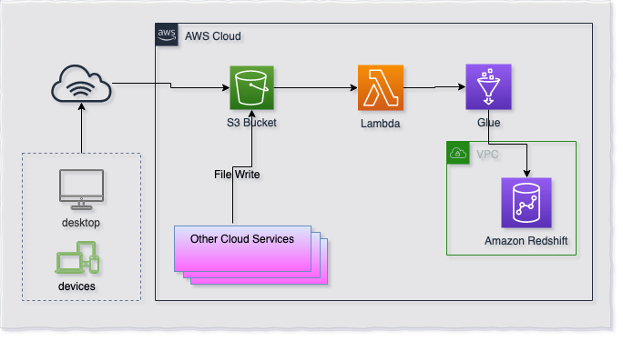

title: Beginners - Serverless ETL for Amazon Redshift
description: Beginners - Serverless ETL for Amazon Redshift
keywords: data lake, datalake, formation, case study, shell, bash, sh, split, size, console, aws, files, tips, cheat, shell command, bash command, script, shell script, sql, teradata, redshift, vba, database, data warehouse, etl, custom, big data, serverless, loader  

<script>
 </script>
 ---
!!! note "Important"  
     This code must not be used for production use as is. This sample is developed only to educate the users in using some of the features of the AWS in developing Serverless ETL for Redshift

# Beginners - Serverless ETL for Amazon Redshift
 
## Overview
This blog post is the first (Beginners Level) postof Serverless ETL for Amazon Redshift series. 
  
 * [Beginners - Serverless ETL for Amazon Redshift](begsrvlsglueredshift.md)  
 * [Intermediate - Serverless ETL for Amazon Redshift](intsrvlsglueredshift.md) 
 * Advance - Serverless ETL for Amazon Redshift ([Coming Soon](advsrvlsglueredshift.md))

This blog post is to help Data Warehousing professionals who are starting learning AWS Services and intrested in basic serverless architecture for ETL/ELT process.  
This post is to show very basic level (100 level) of automation without ETL metadata management and tracking etc. Our next post (Intermediate and Advance) will have details and best practices around Serverless ETL/ELT architecture and step and step guid along with code samples.   

## Services Used
 * [Amazon S3](https://aws.amazon.com/s3/ target="_blank")
 * [AWS Lambda](https://aws.amazon.com/lambda/)
 * [AWS Glue](https://aws.amazon.com/glue/)
 * [Amazon Redshift](https://aws.amazon.com/redshift/)
 
##Architecture
 

 
##Assumptions and Basic Setup
Following are assumption and Basic Setup

 * Amazon Redshift cluster is already setup (see [Launch a Sample Amazon Redshift Cluster](https://docs.aws.amazon.com/redshift/latest/gsg/rs-gsg-launch-sample-cluster.html))
 * S3 Structure setup is `BucketName -> Redshift Schema Name -> Table Name -> Data File(s)`
   You can change the Lambda logic and functionality based on your S3 structure
 
## Setup Amazon Redshift User, Schema and Table
```sql
-- CREATE Group and User
CREATE GROUP grp_rsloader;
CREATE USER rsloader_user PASSWORD 'TechsBoot_2019' IN GROUP grp_rs_loader;

-- Create Schema
CREATE SCHEMA IF NOT EXISTS rsloader;
-- Setup Access Rights on Schema for Group
ALTER DEFAULT PRIVILEGES IN SCHEMA rsloader 
      GRANT ALL ON TABLES TO GROUP grp_rs_loader;
GRANT ALL ON SCHEMA  rsloader TO GROUP grp_rs_loader;
GRANT ALL ON ALL TABLES IN  SCHEMA rsloader TO 
      GROUP grp_rs_loader;
-- Create Table
CREATE TABLE IF NOT EXISTS rsloader.lineitem
(
	l_orderkey INTEGER NOT NULL  
	,l_partkey INTEGER NOT NULL  ENCODE lzo
	,l_suppkey INTEGER NOT NULL  ENCODE lzo
	,l_linenumber INTEGER NOT NULL  ENCODE lzo
	,l_quantity NUMERIC(15,2) NOT NULL  ENCODE lzo
	,l_extendedprice NUMERIC(15,2) NOT NULL  ENCODE lzo
	,l_discount NUMERIC(15,2) NOT NULL  ENCODE lzo
	,l_tax NUMERIC(15,2) NOT NULL  ENCODE lzo
	,l_returnflag VARCHAR(1) NOT NULL  ENCODE lzo
	,l_linestatus VARCHAR(1) NOT NULL  ENCODE lzo
	,l_shipdate DATE NOT NULL  ENCODE lzo
	,l_commitdate DATE NOT NULL  ENCODE lzo
	,l_receiptdate DATE NOT NULL  ENCODE lzo
	,l_shipinstruct VARCHAR(25) NOT NULL  ENCODE lzo
	,l_shipmode VARCHAR(10) NOT NULL  ENCODE lzo
	,l_comment VARCHAR(44) NOT NULL  ENCODE lzo
)
DISTSTYLE KEY
DISTKEY (l_orderkey)
SORTKEY (
	l_orderkey
	)
;
```
## Setup S3 bucket and hierarchy 
 - Create S3 Bucket (we will use `techsboot_rsloader` S3 bucket name in our examples)
 - Create folder `rsloader`  in S3 Bucket
 - Create a subfolder `lineitem`  in `rsloader` folder
 - S3 structure will look like 
 
```
 techsboot_rsloader (or your bucket name)  
 	|__ rsloader  
 	    |__ lineitem
```

## Create IAM Role for AWS Glue
1. Go to [https://console.aws.amazon.com/iam](https://console.aws.amazon.com/iam)
* Click **Roles** in left panel and click **Create role** button
* Select **AWS services** in type of trusted entity and Select/Click **Glue** as the service that will use this role
* Click **Next: Permissions** button at the bottom
* Select **AWSGlueServiceRole** Policy from the list and click **Next: Tags**
* Provide Tags' Key-Values if you want and click **Next: Review**
* Enter Role Name and Description and click **Create role**

## Create IAM Role for AWS Lambda
1. Go to [https://console.aws.amazon.com/iam](https://console.aws.amazon.com/iam)
* Click **Roles** in left panel and click **Create role** button
* Select **AWS services** in type of trusted entity and Select/Click **Lambda** as the service that will use this role
* Click **Next: Permissions** button at the bottom
* Select **AWSLambdaFullAccess** Policy from the list and click **Next: Tags**
* Provide Tags' Key-Values if you want and click **Next: Review**
* Enter Role Name and Description and click **Create role**


## Create AWS Glue Job
1. Go to [https://console.aws.amazon.com/glue](https://console.aws.amazon.com/glue)
* Click on **Jobs** in left panel and click on **Add job** button on main panel
* Enter **Name** `glu_techsboot_rsloader`
* Select IAM Role from list which was created in [previous step](#create-iam-role-for-aws-glue)
* Select `Python shell` in **Type**
* Select `A new script to be authored by you` in **This job runs** section
* Enter **Script file name**
* Select appropriate S3 path to store glue script in **S3 path where the script is stored** section
* Expand **Security configuration, script libraries, and job parameters (optional)** section
* In **Python library path** text box, enter `s3://techsboot/py-ref/pg8000.egg`
* Set **Max concurrency** to `10` to handel 10 file uploads at the same time. Or you can set this number based on your implementation needs. 
* Click **Next**
* Click **Save job and edit script**
* Copy and Paste following python custom code and Glue script editor  
  see [Adding Python Shell Jobs in AWS Glue](https://docs.aws.amazon.com/glue/latest/dg/add-job-python.html) for detailed step by step job creation guid.
- Replace correct values for all variables enclosed in < > within the script.

```python
import os
import sys
import boto3
import json
from awsglue.utils import getResolvedOptions

import pg8000

## @params: [JOB_NAME]
args = getResolvedOptions(sys.argv, ['JOB_NAME', 'schema_name', 'table_name', 's3_file'])
schema_name = args['schema_name']
table_name = args['table_name']
s3_file = args['s3_file']
#
REDSHIFT_DATABASE = "<Your_Redshift_Database>"
REDSHIFT_USER = "rsloader_user"
REDSHIFT_PASSWD = "TechsBoot_2019"
REDSHIFT_PORT = <Your_Redshift_Cluster_Port>
REDSHIFT_ENDPOINT = "<Your_Redshift_EndPoint>"
if not schema_name:
  REDSHIFT_SCHEMA = 'public'
else:
  REDSHIFT_SCHEMA = schema_name
REDSHIFT_TABLE  = table_name
IAM_ROLE  = "arn:aws:iam::<aws_account_number>:role/<Your_Redshift_IAM_Role>"

REDSHIFT_COPY_STATEMENT = """copy {}.{}
          FROM  '{}'
          iam_role '{}'
          TIMEFORMAT AS 'MM/DD/YY HH:MI'
          ; """.format(REDSHIFT_SCHEMA, REDSHIFT_TABLE, s3_file, IAM_ROLE)

try:
    conn = pg8000.connect(
        database=REDSHIFT_DATABASE, 
        user=REDSHIFT_USER, 
        password=REDSHIFT_PASSWD,
        host=REDSHIFT_ENDPOINT,
        port=REDSHIFT_PORT
    )
except Exception as ERROR:
  print("Connection Issue: " + str(ERROR))
  sys.exit(1)

try:
  cursor = conn.cursor()
  # print(REDSHIFT_COPY_STATEMENT)
  cursor.execute(REDSHIFT_COPY_STATEMENT)
  # result = cursor.fetchone()
  cursor.close()
  conn.commit()
  conn.close()
except Exception as ERROR:
  print("Execution Issue: " + str(ERROR))
  sys.exit(1)

```
## Create AWS Lambda Function
1. Go to [https://console.aws.amazon.com/lambda](https://console.aws.amazon.com/lambda)
2. Click **Create function**
3. Select **Author from scratch**
4. Enter `techsboot-rsloader-lambda` in **Function name**
5. Select `Python 3.7` in **Runtime**
6. In **Permissions** section, select `Use an existing role` and then select the role you create in [previous step](#create-iam-role-for-aws-lambda)
7. Click **Create function** button at the bottom
8. Copy and Paste following lambda python code in code editor
9. Click **Save** button
10. Expand **Designer** section in the same window (section above to `Function code`)
11. Click **Add trigger** button
12. Select S3 in **Trigger configuration**
13. Select the S3 Bucket you created in [previous step](#setup-s3-bucket-and-hierarchy)
14. Click **Add**

```python
from datetime import datetime, timedelta
import json
import boto3
client = boto3.client('glue')
#
def lambda_handler(event, context): 
    for record in event['Records']:
        # Getting S3 Bucket Name from event record
        bucket = record['s3']['bucket']['name']
        # Getting S3 Key from event record
        key = record['s3']['object']['key'] 
        # Generating complete S3 file path to pass to Glue Job
        fullS3Path = "s3://" + bucket + "/" + key
        # Splitting S3 Key into Schema Name, Table Name and File Name
        tmp_key = key.split('/',2)
        schema_name = tmp_key[0]
        table_name = tmp_key[1]
        filename = tmp_key[2]
        glue_job_name = "glu_techsboot_rsloader"
        fullS3Message = "This Lambda is triggered by - s3://" + bucket + "/" + key
        # Printing Debugging Message
        print (fullS3Message)
        print ("fullS3Path = " + fullS3Path)
        print ("Bucket = " + bucket)
        print ("Key = " + key)
        print ("schema_name = " + schema_name)
        print ("table_name = " + table_name)
        print ("filename = " + filename)
        # Triggering Glue Job
        print ("Triggering Job = " + glue_job_name)
        response = client.start_job_run(
            JobName = glue_job_name,
            Arguments = {
                '--schema_name':   schema_name,
                '--table_name':  table_name,
                '--s3_file':  fullS3Path } )
        # Converting "response" from Type dict to string
        string_response = json.dumps(response)
        # Parsing JSON response from Glue API
        parsed_response = json.loads(string_response)
        # Printing Job Metadata in Cloudwatch Log
        print("    JOB Metadata           ")        
        print("~~~~~~~~~~~~~~~~~~~~~~~~~~~~~~~~~~~~~~~~~~~~~~~~~~~~~~~~~~~~~~~~~~")        
        print("    --> JobRunID          = " + parsed_response['JobRunId'])
        print("    --> RequestID         = " + parsed_response['ResponseMetadata']['RequestId'])
        print("    --> HTTPStatusCode    = " + str(parsed_response['ResponseMetadata']['HTTPStatusCode']))
        print("    --> Timestamp GMT     = " + parsed_response['ResponseMetadata']['HTTPHeaders']['date'])
        print("    --> content-type      = " + parsed_response['ResponseMetadata']['HTTPHeaders']['content-type'])
        print("    --> content-length    = " + parsed_response['ResponseMetadata']['HTTPHeaders']['content-length'])
        print("    --> connection        = " + parsed_response['ResponseMetadata']['HTTPHeaders']['connection'])
        print("    --> x-amzn-requestid  = " + parsed_response['ResponseMetadata']['HTTPHeaders']['x-amzn-requestid'])
        print("    --> RetryAttempts     = " + str(parsed_response['ResponseMetadata']['RetryAttempts']))
        print("~~~~~~~~~~~~~~~~~~~~~~~~~~~~~~~~~~~~~~~~~~~~~~~~~~~~~~~~~~~~~~~~~~")        
        print(response)
        print("~~~~~~~~~~~~~~~~~~~~~~~~~~~~~~~~~~~~~~~~~~~~~~~~~~~~~~~~~~~~~~~~~~")        

```

## Pre-load testing
1. Connect to Redshift cluster using SQL Client (i.e. SQLWorkbench or DBeaver)
2. Run following SQL, result of this SQL should be `zero (0)`.

	```sql
	SELECT COUNT(*) 
	FROM rsloader.lineitem 
	WHERE l_linestatus in ('C', 'R'); 
	``` 

## Upload sample data into S3
1. Download sample data (2 files) from following links
	- [File 1](https://techsboot.s3-us-west-2.amazonaws.com/sample-data/tpch/lineitem/lineitem_200rec_C.csv)
	-  	[File 2](https://techsboot.s3-us-west-2.amazonaws.com/sample-data/tpch/lineitem/lineitem_200rec_R.csv)  
* Go to [https://console.aws.amazon.com/s3/](https://console.aws.amazon.com/s3/)
* Click on bucket you created in [previous step](#setup-s3-bucket-and-hierarchy)
* Click on `rsloader` folder
* Click on `lineitem` subfolder
* Click on **Upload** button
* Click **Add** on displayed window
* In file selection dialog, select files you downloaded on step 1
* Click **Next**, and then **Next**, and then again **Next** (by keeping next 2 steps of displayed windows as default)
* Click **Upload**

## Verify data in Amazon Redshift
* Connect to Redshift cluster using SQL Client (i.e. SQLWorkbench or DBeaver)  
* Run following SQL

```sql
	SELECT COUNT(*)   
	FROM rsloader.lineitem 
	WHERE l_linestatus in ('C', 'R'); 
``` 
* Result should be like below table

| l_linestatus| count |
| ----------- | ----------- |
| R| 200 |
| C | 200 |
   

