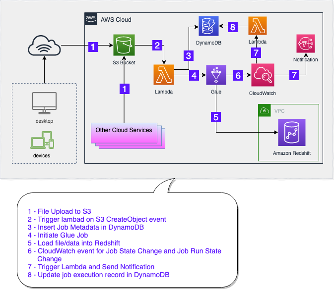

title: Intermediate - Serverless ETL for Amazon Redshift
description: Intermediate - Serverless ETL for Amazon Redshift
keywords: data lake, datalake, formation, case study, shell, bash, sh, split, size, console, aws, files, tips, cheat, shell command, bash command, script, shell script, sql, teradata, redshift, vba, database, data warehouse, etl, custom, big data, serverless, loader  

<script>
 </script>
 ---
!!! note "Important"  
     This code must not be used for production use as is. This sample is developed only to educate the users in using some of the features of the AWS in developing Serverless ETL for Redshift

# Intermediate - Serverless ETL for Amazon Redshift
 
## Overview
This blog post is in continuation of Serverless ETL for Amazon Redshift series. 
  
 * [Beginners - Serverless ETL for Amazon Redshift](begsrvlsglueredshift.md)  
 * [Intermediate - Serverless ETL for Amazon Redshift](intsrvlsglueredshift.md) 
 * Advance - Serverless ETL for Amazon Redshift ([Coming Soon](advsrvlsglueredshift.md))
 
This post is to show some intermediate level of automation with limited ETL metadata management and job tracking etc. Our next post [Advance - Serverless ETL for Amazon Redshift](advsrvlsglueredshift.md) will have comprehensive design and best practices around Serverless ETL/ELT architecture and step and step guid along with code samples. 
 
##Architecture

##Assumptions
Assumption for this post is that following steps are already performed using our [previous blog post](begsrvlsglueredshift.md).

* [Assumptions and Basic Setup](begsrvlsglueredshift.md#assumptions-and-basic-setup) 
* [Setup Amazon Redshift User, Schema and Table](begsrvlsglueredshift.md#setup-amazon-redshift-user-schema-and-table) 
* [Setup S3 bucket and hierarchy](begsrvlsglueredshift.md#setup-s3-bucket-and-hierarchy)
* [Create IAM Role for AWS Glue](begsrvlsglueredshift.md#create-iam-role-for-aws-glue)
* [Create IAM Role for AWS Lambda](begsrvlsglueredshift.md#create-iam-role-for-aws-lambda)

## Create a DynamoDB table to capture job log
1. Go to [https://console.aws.amazon.com/dynamodb](https://console.aws.amazon.com/dynamodb)
2. Click on **Tables** in left panel and click on **Create table** button.
3. Enter following information in relevent text boxes:
	- **Table name**: `DD_JobExecLog` 
	- **Primary partition key**: `JobName` (with String data type)
	- Check the checkbox `Add sort key`
	- **Primary sort key**:	`JobRunID` (with String data type)
4. Keep rest as default and click `Create` button at the bottom of the page.

## Create SNS topic
1. Go to [https://console.aws.amazon.com/sns](https://console.aws.amazon.com/sns)
2. Click on **Topics** in left panel and click on **Create topic** button.
3. Enter **Name** `techsboot-rsloader-notification`
4. Enter **Display name** `techsbootSNS`
3. Click **Create topic** button at the bottom of the page

## Subscribe to SNS topic
1. Go to [https://console.aws.amazon.com/sns](https://console.aws.amazon.com/sns)
2. Click on **Topics** in left panel and click on the topic `techsboot-rsloader-notification`.
3. Click **Create subscription**
4. Leave **Topic ARN** as default
4. Select `Email` from **Protocol** dropdown
3. In **Endpoint**, enter an email address where notification email should be sent.
4. Click on **Create subscription** button at the bottom of the page.

!!! note "Note"  
     Amazon SNS service will send a varification email to the provided email address before enabling this subscription. So don't forget to check email and confirm subscription in order to receive notifications from this SNS topic.

 
## Create AWS Glue Job
1. Go to [https://console.aws.amazon.com/glue](https://console.aws.amazon.com/glue)
* Click on **Jobs** in left panel and click on **Add job** button on main panel
* Enter **Name** `glu_techsboot_rsloader`
* Select IAM Role from list which was created in [previous step](#create-iam-role-for-aws-glue)
* Select `Python shell` in **Type**
* Select `A new script to be authored by you` in **This job runs** section
* Enter **Script file name**
* Select appropriate S3 path to store glue script in **S3 path where the script is stored** section
* Expand **Security configuration, script libraries, and job parameters (optional)** section
* In **Python library path** text box, enter `s3://techsboot/py-ref/pg8000.egg`
* Set **Max concurrency** to `10` to handel 10 file uploads at the same time. Or you can set this number based on your implementation needs. 
* Click **Next**
* Click **Save job and edit script**
* Copy and Paste following python custom code and Glue script editor  
  see [Adding Python Shell Jobs in AWS Glue](https://docs.aws.amazon.com/glue/latest/dg/add-job-python.html) for detailed step by step job creation guid.
- Replace correct values for all variables enclosed in < > within the script.

```python
import os

import sys
import boto3
import json
from awsglue.utils import getResolvedOptions

import pg8000

## @params: [JOB_NAME]
args = getResolvedOptions(sys.argv, ['JOB_NAME', 'schema_name', 'table_name', 's3_file'])
schema_name = args['schema_name']
table_name = args['table_name']
s3_file = args['s3_file']

#
REDSHIFT_DATABASE = "<Your_Redshift_Database>"
REDSHIFT_USER = "rsloader_user"
REDSHIFT_PASSWD = "TechsBoot_2019"
REDSHIFT_PORT = <Your_Redshift_Cluster_Port>
REDSHIFT_ENDPOINT = "<Your_Redshift_EndPoint>"

if not schema_name:
  REDSHIFT_SCHEMA = 'public'
else:
  REDSHIFT_SCHEMA = schema_name
REDSHIFT_TABLE  = table_name
IAM_ROLE  = "arn:aws:iam::<aws_account_number>:role/<Your_Redshift_IAM_Role>"

# REDSHIFT_QUERY = "SELECT DISTINCT tablename FROM pg_table_def WHERE schemaname = 'public' ORDER BY tablename"
REDSHIFT_COPY_STATEMENT = """copy {}.{}
          FROM  '{}'
          iam_role '{}'
          TIMEFORMAT AS 'MM/DD/YY HH:MI'
          ; """.format(REDSHIFT_SCHEMA, REDSHIFT_TABLE, s3_file, IAM_ROLE)

try:
    conn = pg8000.connect(
        database=REDSHIFT_DATABASE, 
        user=REDSHIFT_USER, 
        password=REDSHIFT_PASSWD,
        host=REDSHIFT_ENDPOINT,
        port=REDSHIFT_PORT
    )
except Exception as ERROR:
  print("Connection Issue: " + str(ERROR))
  sys.exit(1)

try:
  cursor = conn.cursor()
  cursor.execute(REDSHIFT_COPY_STATEMENT)
  cursor.close()
  conn.commit()
  conn.close()
except Exception as ERROR:
  print("Execution Issue: " + str(ERROR))
  sys.exit(1)

```
## Create AWS Lambda Function to invoke Glue Job
1. Go to [https://console.aws.amazon.com/lambda](https://console.aws.amazon.com/lambda)
2. Click **Create function**
3. Select **Author from scratch**
4. Enter `techsboot-rsloader-trigger-lambda` in **Function name**
5. Select `Python 3.7` in **Runtime**
6. In **Permissions** section, select `Use an existing role` and then select the role you created in [Create IAM Role for AWS Lambda](begsrvlsglueredshift.md#create-iam-role-for-aws-lambda) section
7. Click **Create function** button at the bottom
8. Copy and Paste following lambda python code in code editor
9. Click **Save** button
10. Expand **Designer** section in the same window (section above to `Function code`)
11. Click **Add trigger** button
12. Select S3 in **Trigger configuration**
13. Select the S3 Bucket you created in [Setup S3 bucket and hierarchy](begsrvlsglueredshift.md#setup-s3-bucket-and-hierarchy) section
14. Click **Add**
 
```python
from datetime import datetime, timedelta
import json
import boto3
client = boto3.client('glue')
dd = boto3.resource('dynamodb')
table = dd.Table('DD_JobExecLog')

def lambda_handler(event, context): 
    start_timestamp = str(datetime.now())
    for record in event['Records']:
        # Getting S3 Bucket Name from event record
        bucket = record['s3']['bucket']['name']
        # Getting S3 Key from event record
        key = record['s3']['object']['key'] 
        # Generating complete S3 file path to pass to Glue Job
        fullS3Path = "s3://" + bucket + "/" + key
        # Splitting S3 Key into Schema Name, Table Name and File Name
        tmp_key = key.split('/',2)
        schema_name = tmp_key[0]
        table_name = tmp_key[1]
        filename = tmp_key[2]
        glue_job_name = "glu_techsboot_rsloader"
        fullS3Message = "This Lambda is triggered by - s3://" + bucket + "/" + key
        # Triggering Glue Job
        print ("Triggering Job = " + glue_job_name)
        response = client.start_job_run(
            JobName = glue_job_name,
            Arguments = {
                '--schema_name':   schema_name,
                '--table_name':  table_name,
                '--s3_file':  fullS3Path } )
        # Converting "response" from Type dict to string
        string_response = json.dumps(response)
        # Parsing JSON response from Glue API
        parsed_response = json.loads(string_response)
        ###########################
        #
        #  
        table.put_item(
           Item={
                'JobName': glue_job_name,
                'JobRunID': parsed_response['JobRunId'],
                'job_state': 'STARTED (Lambda)',
                'start_timestamp': start_timestamp,
                'update_timestamp': 'null',
                'job_message': 'Job Triggered by Lambda',
                'job_severity': 'null',
                's3_file_key': fullS3Path,
                'job_region': 'null',
                'job_time': 'null',
                'job_account': 'null',
                'glue_metadata': parsed_response
            }
        )
        # Printing Job Metadata in Cloudwatch Log
        print("    JOB Metadata           ")        
        print("~~~~~~~~~~~~~~~~~~~~~~~~~~~~~~~~~~~~~~~~~~~~~~~~~~~~~~~~~~~~~~~~~~")        
        print("    --> JobRunID          = " + parsed_response['JobRunId'])
        print("    --> RequestID         = " + parsed_response['ResponseMetadata']['RequestId'])
        print("    --> HTTPStatusCode    = " + str(parsed_response['ResponseMetadata']['HTTPStatusCode']))
        print("    --> Timestamp GMT     = " + parsed_response['ResponseMetadata']['HTTPHeaders']['date'])
        print("    --> content-type      = " + parsed_response['ResponseMetadata']['HTTPHeaders']['content-type'])
        print("    --> content-length    = " + parsed_response['ResponseMetadata']['HTTPHeaders']['content-length'])
        print("    --> connection        = " + parsed_response['ResponseMetadata']['HTTPHeaders']['connection'])
        print("    --> x-amzn-requestid  = " + parsed_response['ResponseMetadata']['HTTPHeaders']['x-amzn-requestid'])
        print("    --> RetryAttempts     = " + str(parsed_response['ResponseMetadata']['RetryAttempts']))
        print("~~~~~~~~~~~~~~~~~~~~~~~~~~~~~~~~~~~~~~~~~~~~~~~~~~~~~~~~~~~~~~~~~~")        
        print(response)
        print("~~~~~~~~~~~~~~~~~~~~~~~~~~~~~~~~~~~~~~~~~~~~~~~~~~~~~~~~~~~~~~~~~~")              

```
## Create AWS Lambda Function for Glue job progress and status logging
1. Go to [https://console.aws.amazon.com/lambda](https://console.aws.amazon.com/lambda)
2. Click **Create function**
3. Select **Author from scratch**
4. Enter `techsboot-rsloader-gluelogger-lambda` in **Function name**
5. Select `Python 3.7` in **Runtime**
6. In **Permissions** section, select `Use an existing role` and then select the role you create in [Create IAM Role for AWS Lambda](begsrvlsglueredshift.md#create-iam-role-for-aws-lambda) section
7. Click **Create function** button at the bottom
8. Copy and Paste following lambda python code in code editor
9. Click **Save** button

```python
from datetime import datetime, timedelta
import json
import boto3
dd = boto3.resource('dynamodb')
table = dd.Table('DD_JobExecLog')

def lambda_handler(event, context):
    #print("Received event: " + json.dumps(event, indent=2))
    jobName = event['detail']['jobName']
    jobRunId = event['detail']['jobRunId']
    job_time = event['time']
    j_account = event['account']
    j_region = event['region']
    j_severity = event['detail']['severity']
    j_state = event['detail']['state']
    j_message = event['detail']['message']
    update_timestamp = str(datetime.now())
#
    if jobName == "glu_techsboot_rsloader": 
        table.update_item(
            Key={
                'JobName': jobName,
                'JobRunID': jobRunId
            },
            UpdateExpression='SET job_message= :msg, job_severity= :sev, update_timestamp = :upd_ts, job_time= :jb_tm, job_region= :j_region, job_state= :v_state, job_account= :acc ',
            ExpressionAttributeValues={
                ':upd_ts': update_timestamp,
                ':jb_tm': job_time,
                ':j_region': j_region,
                ':sev':  j_severity,
                ':v_state': j_state,
                ':msg': j_message,
                ':acc': j_account
            }
        )
#
        print("current_timestamp: " + str(datetime.now()))
        print("account: " + j_account)
        print("time: " + job_time)
        print("region: " + j_region)
        print("jobName: " + jobName)
        print("severity: " + j_severity)
        print("state: " + j_state)
        print("jobRunId: " + jobRunId)
        print("message: " + j_message)
        print("-----------------------------")
        print("From Glue Job Event : " + json.dumps(event))

```

## Add CloudWatch Event Rule to capture Glue job status
1. Go to [https://console.aws.amazon.com/cloudwatch](https://console.aws.amazon.com/cloudwatch)
2. Click **Rules** in left panel under **Events** section and click **Create rule** button
3. In **Event Srouce** section, click on **Event Pattern** radio button.
4. From **Event Pattern** dropdown, select **Build custom event pattern** and copy/paste follwoing JSON

```JSON
{
   "source": ["aws.glue"],
   "detail-type": 
    [
        "Glue Job State Change",
        "Glue Job Run Status"
    ]
}
```
4. In **Targets** (_right side_) section,  click **Add target**
5. Select `Lambda function` in first dropdown
6. Select `techsboot-rsloader-gluelogger-lambda` lambda fuction created in previous steps in **Function** dropdown.
6. Click **Add target** again to add another target
7. Select `SNS Topic` in first dropdown
8. Select `techsboot-rsloader-notification` SNS topic (_created in previous steps_) in **Topic** dropdown.
7. Click **Configure details** button at the bottom
8. In **Name** text box, enter `techsboot-rsloader-gluestatus-rule` and provide a **Description** text.
9. Click **Create rule** button

## Data loading and validation
We are using the following steps for Data loading and validation same as we performed for our [Beginner post](begsrvlsglueredshift.md)

* [Pre-load testing](begsrvlsglueredshift.md#pre-load-testing)
* [Upload sample data into S3](begsrvlsglueredshift.md#upload-sample-data-into-s3) 
* [Verify data in Amazon Redshift](begsrvlsglueredshift.md#verify-data-in-amazon-redshift) 

## Validate loggin in DynamoDB Table
1. Go to [https://console.aws.amazon.com/dynamodb](https://console.aws.amazon.com/dynamodb)
2. Click on **Tables** in left panel and click on **_DD\_JobExecLog_** to open table.
3. Click on **Items** tab to see the job status records in DynamoDB table
   